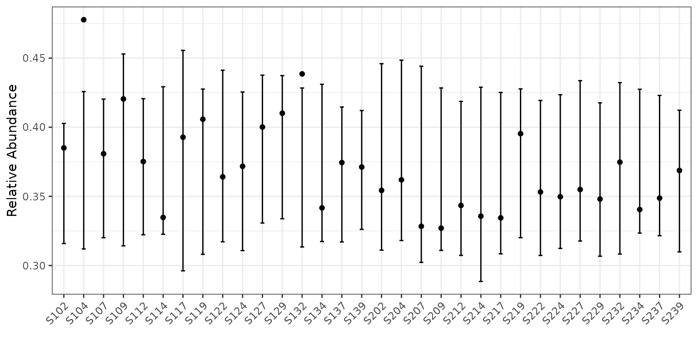
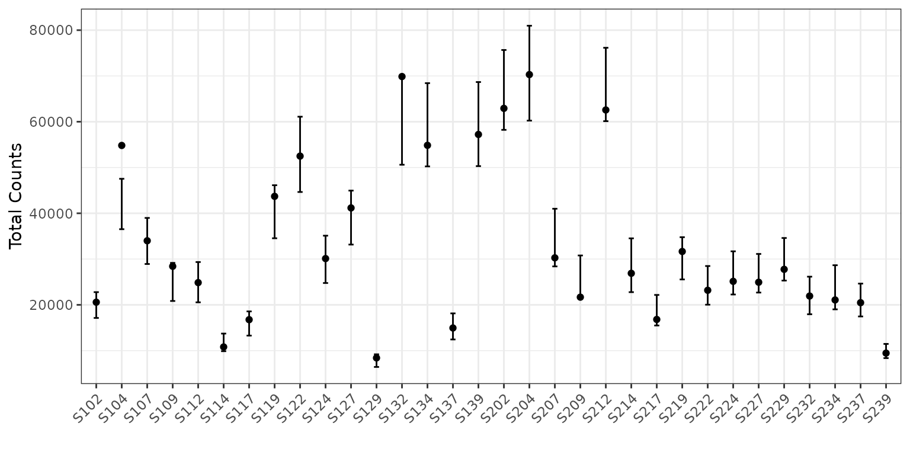
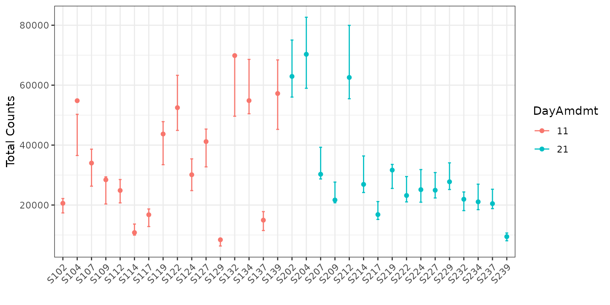
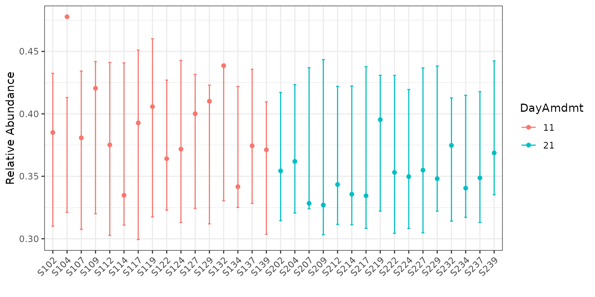
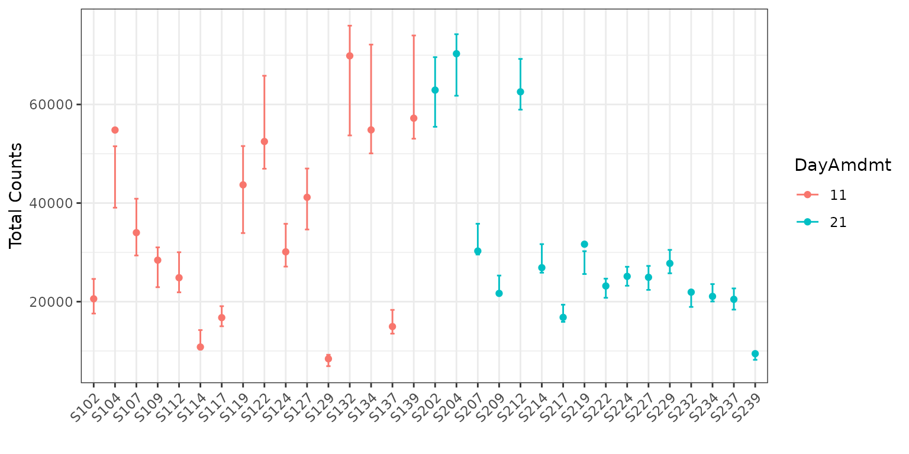
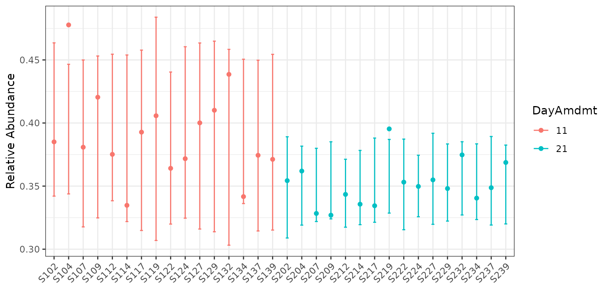
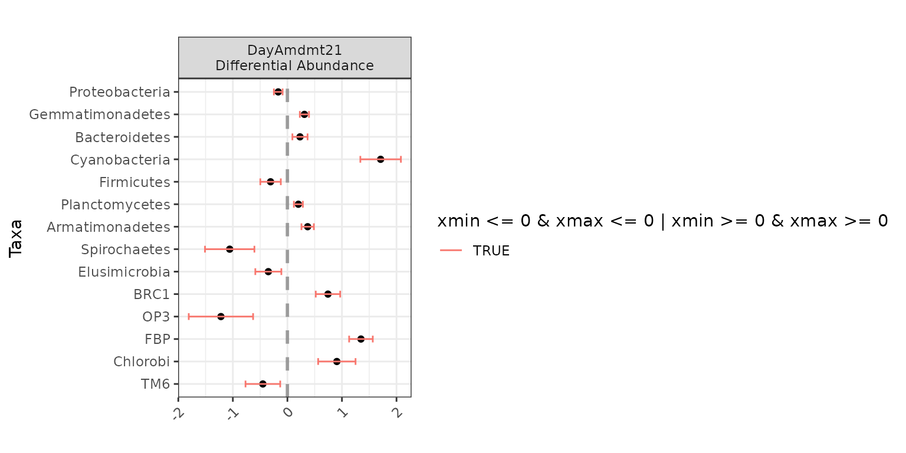
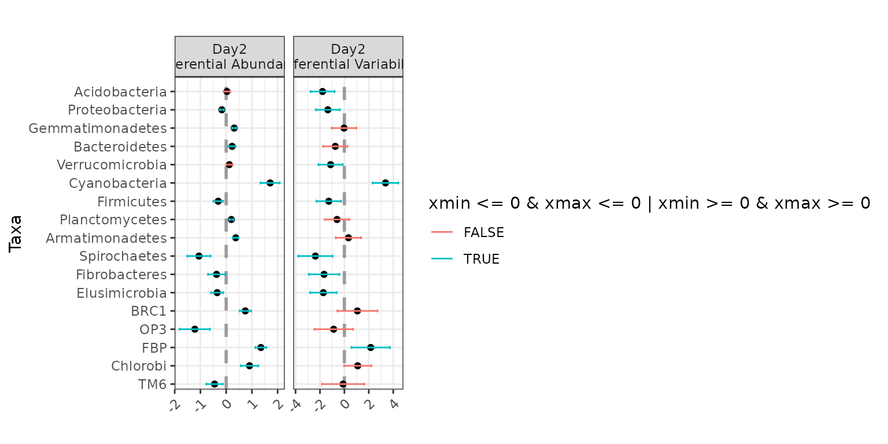

# Introduction to corncob, no phyloseq

## Vignette Information

This is a version of the `corncob-intro.Rmd` vignette that does not rely
on the package `phyloseq`. To see how to use `corncob` with `phyloseq`
objects, or to see an additional analysis with an IBD microbiome
dataset, check out the original `corncob-intro.Rmd` vignette.

We thank Dr. Thea Whitman for kindly providing us with the example data
set we use for this vignette. You can read more about this data in
Whitman, Thea, et al. “Dynamics of microbial community composition and
soil organic carbon mineralization in soil following addition of
pyrogenic and fresh organic matter.” *The ISME Journal* 10.12 (2016):
2918.

## Introduction

Effectively modeling microbial relative abundance poses a number of
statistical challenges, including:

Here, we introduce `corncob`, an individual taxon regression model that
uses abundance tables and sample data. `corncob` is able to model
differential abundance and differential variability, and addresses each
of the challenges presented above.

Install `corncob` using:

``` r
remotes::install_github("statdivlab/corncob")
```

To begin, we load our example data set we load our example data set as
three different data frames

``` r
library(corncob)
library(magrittr)
data(soil_phylo_sample)
data(soil_phylo_otu)
data(soil_phylo_taxa)
```

We can see that we have 5 sample variables. Let’s look at the first few
observations.

``` r
head(soil_phylo_sample)
```

    ##      Plants DayAmdmt Amdmt ID Day
    ## S009      1       01     1  D   0
    ## S204      1       21     1  D   2
    ## S112      0       11     1  B   1
    ## S247      0       22     2  F   2
    ## S026      0       00     0  A   0
    ## S023      1       00     0  C   0

Our covariates are as follows:

Additionally, we have a table that gives us counts of the phyla by
sample. Let’s take a look at the first 5 phyla and the first 5 samples.

``` r
soil_phylo_otu[1:5, 1:5]
```

    ##         S009 S204 S112 S247 S026
    ## OTU.43   350   74  300   70   43
    ## OTU.2   1796 4204 1752  695  945
    ## OTU.187  280  709  426  100  139
    ## OTU.150   33  151   18   13   28
    ## OTU.91     0    0  184    0    0

Finally, we have a taxonomy table with 7 taxonomic ranks.

``` r
soil_phylo_taxa[1:3, ]
```

    ##         Kingdom    Phylum           Class                 Order             
    ## OTU.43  "Bacteria" "Nitrospirae"    "Nitrospira"          "Nitrospirales"   
    ## OTU.2   "Bacteria" "Proteobacteria" "Alphaproteobacteria" "Rhizobiales"     
    ## OTU.187 "Bacteria" "Acidobacteria"  "Acidobacteriia"      "Acidobacteriales"
    ##         Family              Genus            Species
    ## OTU.43  "Nitrospiraceae"    "Nitrospira"     ""     
    ## OTU.2   "Bradyrhizobiaceae" "Bradyrhizobium" ""     
    ## OTU.187 "Koribacteraceae"   ""               ""

## Fitting a Model

First, let’s subset our samples to only include those with the
`DayAmdmt` covariate equal to 11 or 21 and then collapse the samples to
the phylum level. We have already done this and saved the resulting
sample data frame and otu data frame.

``` r
data(soil_phylum_small_sample)
sample_data <- soil_phylum_small_sample
data(soil_phylum_small_otu)
data <- soil_phylum_small_otu
```

Note that collapsing the samples is not necessary, and this model can
work at any taxonomic rank. However, we will later be fitting a model to
every taxa. We can see that by agglomerating taxa to the phylum level,
we have gone from from 7770 to 40 taxa. Thus we collapse in order to
increase the speed for the purposes of this tutorial.

Now we fit our model. We will demonstrate with Proteobacteria. We will
need to make a data frame that includes our sample data as well as the
Proteobacteria counts and sequencing depths for each sample.

``` r
pro_data <- cbind(sample_data, 
                  W = unlist(data["Proteobacteria", ]),
                  M = colSums(data))
```

For now, we will not include any covariates, so we use `~ 1` as our
model formula responses.

``` r
corncob <- bbdml(formula = cbind(W, M - W) ~ 1,
             phi.formula = ~ 1,
             data = pro_data)
```

## Interpreting a Model

First, let’s plot the data with our model fit on the relative abundance
scale. To do this, we simply type:

``` r
plot(corncob, B = 50)
```



You can access the documentation for this plotting function by typing
[`?plot.bbdml`](https://statdivlab.github.io/corncob/reference/plot.bbdml.md)
into the console.

The points represent the relative abundances. The bars represent the 95%
prediction intervals for the observed relative abundance by sample. The
parameter `B` determines the number of bootstrap simulations used to
approximate the prediction intervals. For purposes of this tutorial, we
use a small value `B = 50` for computational purposes, but recommend a
higher setting for more accurate intervals, such as the default
`B = 1000`.

Now let’s look at the same plot, but on the counts scale with 95%
prediction intervals (since counts is not a parameter). To do this, we
add the option `total = TRUE` to our plotting code.

``` r
plot(corncob, total = TRUE, B = 50)
```



Finally, let’s color the plot by the `DayAmdmt` covariate. To do this,
we add the option `color = "DayAmdmt"` to our plotting code.

``` r
plot(corncob, total = TRUE, color = "DayAmdmt", B = 50)
```



``` r
plot(corncob, color = "DayAmdmt", B = 50)
```



Notice that this plot also reorders our samples so that groups appear
together so that they are easier to compare.

We can observe on this plot that it might be of interest to distinguish
between the two groups with covariates. The average empirical relative
abundance for the samples with `DayAmdmt = 21` tends to be lower and
less variable than the samples with `DayAmdmt = 11`.

## Adding covariates

Let’s try modeling the expected relative abundance and the variability
of the counts with `DayAmdmt` as a covariate. We do this by modifying
`formula` and `phi.formula` as:

``` r
corncob_da <- bbdml(formula = cbind(W, M - W) ~ DayAmdmt,
             phi.formula = ~ DayAmdmt,
             data = pro_data)
```

Let’s also plot this data on both the total count and relative abundance
scales.

``` r
plot(corncob_da, color = "DayAmdmt", total = TRUE, B = 50)
```



``` r
plot(corncob_da, color = "DayAmdmt", B = 50)
```



Visually, the model with covariates seems to provide a much better fit
to the data, but how can we compare the two models statistically?

## Model Selection

Let’s use a likelihood ratio test to select our final model for this
taxon. We want to test the null hypothesis that the likelihood of the
model with covariates is equal to the likelihood of the model without
covariates. To do this test, we use:

``` r
lrtest(mod_null = corncob, mod = corncob_da)
```

    ## [1] 4.550571e-05

We obtain a p-value much smaller than a cut-off of 0.05. Therefore we
conclude that there is a statistically significant difference in the
likelihood of the two models. Thus, we probably want to use the model
with covariates for this taxon.

## Parameter Interpretation

Now that we have chosen our model, let’s interpret our model output. To
see a summary of the model, type:

``` r
summary(corncob_da)
```

    ## 
    ## Call:
    ## bbdml(formula = cbind(W, M - W) ~ DayAmdmt, phi.formula = ~DayAmdmt, 
    ##     data = pro_data)
    ## 
    ## 
    ## Coefficients associated with abundance:
    ##             Estimate Std. Error t value Pr(>|t|)    
    ## (Intercept) -0.44595    0.03604 -12.375 7.18e-13 ***
    ## DayAmdmt21  -0.16791    0.04067  -4.129 0.000297 ***
    ## ---
    ## Signif. codes:  0 '***' 0.001 '**' 0.01 '*' 0.05 '.' 0.1 ' ' 1
    ## 
    ## 
    ## Coefficients associated with dispersion:
    ##             Estimate Std. Error t value Pr(>|t|)    
    ## (Intercept)  -5.3077     0.3537 -15.008 6.44e-15 ***
    ## DayAmdmt21   -1.3518     0.5029  -2.688    0.012 *  
    ## ---
    ## Signif. codes:  0 '***' 0.001 '**' 0.01 '*' 0.05 '.' 0.1 ' ' 1
    ## 
    ## 
    ## Log-likelihood: -286.53

This output will look familiar if you have done regression analysis in R
in the past. Covariates associated with the expected relative abundance
are presented separately from covariates associated with the variance of
the counts are preceded by.

From this model summary, we can see that the `DayAmdmt21` abundance
coefficient is negative and statistically significant. This suggests
that this taxon is differentially-abundant across `DayAmdmt`, and that
samples with `DayAmdmt = 21` are expected to have a lower relative
abundance. This matches what we saw from the observed abundances.

We can also see that the `DayAmdmt21` dispersion coefficient is negative
and statistically significant. This suggests that this taxon is
differentially-variable across `DayAmdmt`, and that samples with
`DayAmdmt = 21` are expected to have a lower variability. This matches
what we saw from the observed abundances.

## Analysis for Multiple Taxa

What if we want to test all the taxa in our data to see if they are
differentially-abundant or differentially-variable? We use the
`differentialTest` function. It will perform the above tests on all
taxa, and it will control the false discovery rate to account for
multiple comparisons.

Next, we use the `differentialTest` command. We specify the covariates
of our model using `formula` and `phi.formula` as before, except we no
longer include the response term because we are testing multiple taxa.
We also specify which covariates we want to test for by removing them in
the `formula_null` and `phi.formula_null` arguments.

The difference between the formulas and the null version of the formulas
are the variables that we test. We will go through several examples,
starting with a test for differential abundance across the `DayAmdmt`
coefficient.

We set `fdr_cutoff` to be our controlled false discovery rate.

Here, we will pass in our entire count table for all phyla as the `data`
argument (setting `taxa_are_rows` to `TRUE`), and the sample data frame
as the `sample_data` argument.

``` r
set.seed(1)
da_analysis <- differentialTest(formula = ~ DayAmdmt,
                                 phi.formula = ~ DayAmdmt,
                                 formula_null = ~ 1,
                                 phi.formula_null = ~ DayAmdmt,
                                 test = "Wald", boot = FALSE,
                                 data = data,
                                 sample_data = sample_data,
                                 taxa_are_rows = TRUE, 
                                 fdr_cutoff = 0.05)
```

We can see the output of the function by calling it:

``` r
da_analysis
```

    ## Object of class differentialTest 
    ## 
    ## $p: p-values 
    ## $p_fdr: FDR-adjusted p-values 
    ## $significant_taxa: taxa names of the statistically significant taxa 
    ## $significant_models: model summaries of the statistically significant taxa 
    ## $all_models: all model summaries 
    ## $restrictions_DA: covariates tested for differential abundance 
    ## $restrictions_DV: covariates tested for differential variability 
    ## $discriminant_taxa_DA: taxa for which at least one covariate associated with the abundance was perfectly discriminant 
    ## $discriminant_taxa_DV: taxa for which at least one covariate associated with the dispersion was perfectly discriminant 
    ## 
    ## plot( ) to see a plot of tested coefficients from significant taxa

We can see a list of differentially-abundant taxa using:

``` r
da_analysis$significant_taxa
```

    ##  [1] "Proteobacteria"   "Gemmatimonadetes" "Bacteroidetes"    "Cyanobacteria"   
    ##  [5] "Firmicutes"       "Planctomycetes"   "Armatimonadetes"  "Spirochaetes"    
    ##  [9] "Elusimicrobia"    "BRC1"             "OP3"              "FBP"             
    ## [13] "Chlorobi"         "TM6"

In this case, we identified 14 taxa that are differentially-abundant
across `DayAmdmt` (out of the 39 taxa tested).

We can see a list of differentially-variable taxa using:

``` r
set.seed(1)
dv_analysis <- differentialTest(formula = ~ DayAmdmt,
                                 phi.formula = ~ DayAmdmt,
                                 formula_null = ~ DayAmdmt,
                                 phi.formula_null = ~ 1,
                                 test = "LRT", boot = FALSE,
                                 data = data,
                                 sample_data = sample_data,
                                 taxa_are_rows = TRUE, 
                                 fdr_cutoff = 0.05)
dv_analysis$significant_taxa
```

    ## [1] "Acidobacteria" "Cyanobacteria" "Spirochaetes"  "Elusimicrobia"
    ## [5] "FBP"

In this case, we identified 5 taxa that are differentially-variable
across `DayAmdmt` (out of the 40 taxa tested).

We can examine a subset of the p-values of our tests using:

``` r
da_analysis$p[1:5]
```

    ##    Acidobacteria   Proteobacteria Gemmatimonadetes   Actinobacteria 
    ##     6.509417e-01     3.642734e-05     3.270448e-13     3.703095e-01 
    ##         [Thermi] 
    ##     1.031419e-01

We can examine a subset of the p-values after controlling for the false
discovery rate using:

``` r
da_analysis$p_fdr[1:5]
```

    ##    Acidobacteria   Proteobacteria Gemmatimonadetes   Actinobacteria 
    ##     7.811301e-01     1.457094e-04     3.924537e-12     5.172748e-01 
    ##         [Thermi] 
    ##     2.062838e-01

where the values are now adjusted to control the false discovery rate at
0.05.

Now we can use the built-in plotting function in corncob to view the the
model coefficients used in testing differential abundance across
`DayAmdmt` via the
[`plot()`](https://rdrr.io/r/graphics/plot.default.html) function. You
can access the documentation for this plotting function by typing
[`?plot.differentialTest`](https://statdivlab.github.io/corncob/reference/plot.differentialTest.md)
into the console.

``` r
plot(da_analysis)
```



Here, we can see that for `Bacteria_Armatimonadetes`, the effect of
`DayAmdmt21` is positive compared to the baseline (in this case,
`DayAmdmt11`).

If you wish to instead make your own custom plots with these same
coefficients, you can easily extract the data used to generate the plots
above from the `plot` function by setting `data_only = TRUE`:

``` r
df <- plot(da_analysis, data_only = TRUE)

# we can easily remove special characters used in our formatting steps
df <- df %>%
  dplyr::mutate(variable = gsub("\nDifferential Abundance", "",
                                variable, fixed = TRUE))

head(df)
```

    ##            x        xmin        xmax             taxa   variable
    ## 1 -0.1679129 -0.24761731 -0.08820844   Proteobacteria DayAmdmt21
    ## 2  0.3119623  0.22800588  0.39591870 Gemmatimonadetes DayAmdmt21
    ## 3  0.2306765  0.09148981  0.36986312    Bacteroidetes DayAmdmt21
    ## 4  1.7090454  1.33732670  2.08076404    Cyanobacteria DayAmdmt21
    ## 5 -0.3087530 -0.49665466 -0.12085125       Firmicutes DayAmdmt21
    ## 6  0.2013158  0.11895313  0.28367838   Planctomycetes DayAmdmt21

Finally, we can see a list of any taxa for which we were not able to fit
a model using:

``` r
which(is.na(da_analysis$p)) %>% names
```

    ## [1] "GN04"   "GN02"   "MVP-21"

In this case, we weren’t able to fit `GN04` automatically. It’s
worthwhile to investigate the OTU individually if this is the case.

It may be that the model is overparameterized because there aren’t
enough observations, or it may just be that the initializations were
invalid for that taxa and it needs to be re-evaluated with new
initializations.

Let’s first try examining the data.

``` r
data["GN04", ]
```

    ##      S204 S112 S134 S207 S202 S139 S122 S212 S117 S104 S214 S109 S217 S229 S132
    ## GN04    0    0    0    0    0    0    0    0    0    0    0    0    0    0    0
    ##      S209 S227 S107 S237 S224 S127 S137 S114 S124 S119 S219 S232 S129 S102 S234
    ## GN04    0    0    0    0    0    0    0    0    0    0    0    0    0    1    0
    ##      S222 S239
    ## GN04    0    0

We see that the observed counts of OTU is zero in all samples except for
`S102`, where we observed a single count. We should be skeptical of
**any** statistical model fit on a single observed count!

`corncob` is stable, but if you notice any issues, please [log them on
Github](https://github.com/statdivlab/corncob/issues) to help us help
you!

## Examples of Answering Scientific Questions

We will now walk through several scientific questions of interest and
show how they can be answered using hypothesis testing with `corncob`.
Note that `Day` and `Amdmt` are both factor covariates with levels 0, 1,
and 2.

Note that some of these are rather strange tests, and shown for
demonstration of the flexibility of the model only. Normally, when
testing for differential variability across a covariate, we recommend
always controlling for the effect of that covariate on the abundance. We
first demonstrate examples with the small version of the soil dataset
(note, this is a slightly different subset of the data from that used in
`corncob-intro.Rmd`).

Testing for differential abundance across `Day`, without controlling for
anything else:

``` r
ex1 <- differentialTest(formula = ~ Day,
                        phi.formula = ~ 1,
                        formula_null = ~ 1,
                        phi.formula_null = ~ 1,
                        data = data,
                        taxa_are_rows = TRUE,
                        sample_data = sample_data, 
                        test = "Wald", boot = FALSE,
                        fdr_cutoff = 0.05)
plot(ex1)
```


Testing for differential abundance across `Day`, controlling for the
effect of `Day` on dispersion:

``` r
ex2 <- differentialTest(formula = ~ Day,
                        phi.formula = ~ Day,
                        formula_null = ~ 1,
                        phi.formula_null = ~ Day,
                        data = data,
                        taxa_are_rows = TRUE,
                        sample_data = sample_data, 
                        test = "Wald", boot = FALSE,
                        fdr_cutoff = 0.05)
plot(ex2)
```


Jointly testing for differential abundance and differential variability
across `Day`:

``` r
ex3 <- differentialTest(formula = ~ Day,
                        phi.formula = ~ Day,
                        formula_null = ~ 1,
                        phi.formula_null = ~ 1,
                        data = data,
                        taxa_are_rows = TRUE,
                        sample_data = sample_data, 
                        test = "Wald", boot = FALSE,
                        fdr_cutoff = 0.05)
plot(ex3)
```



More examples of answering scientific questions with a larger subset of
this soil data set and with an IBD data set can be seen in
`corncob-intro.Rmd`.
