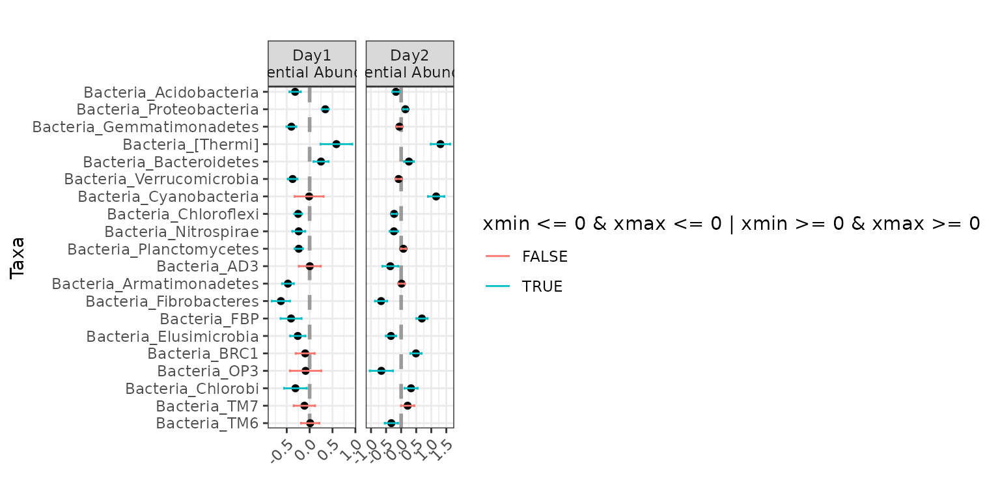
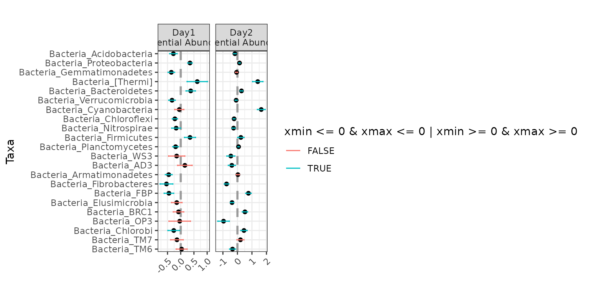
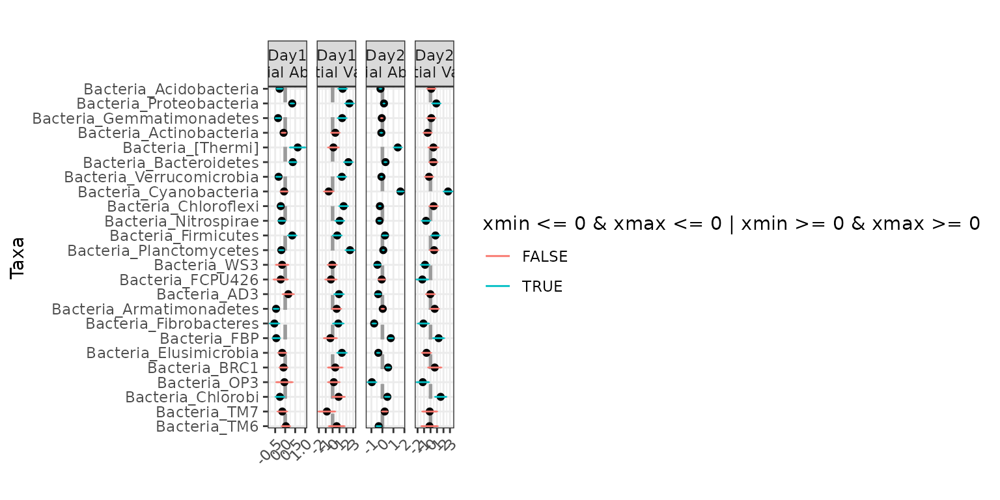
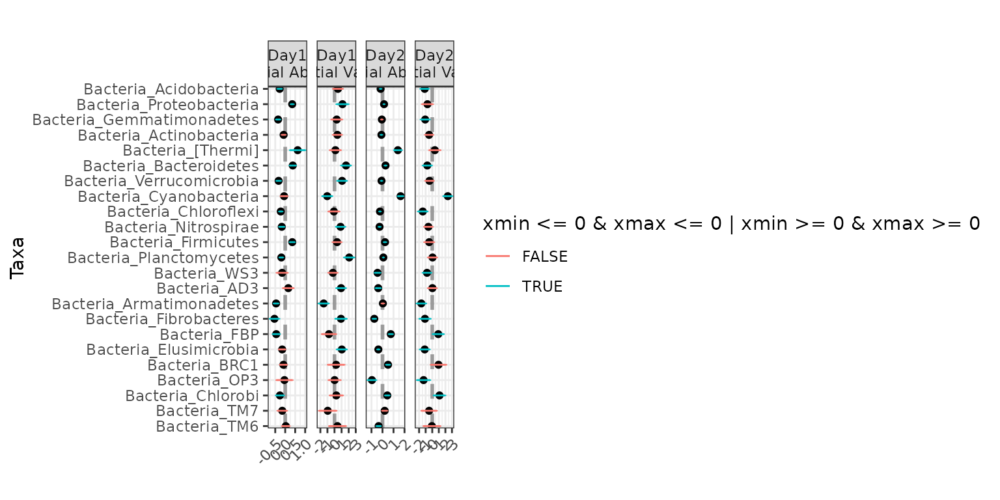
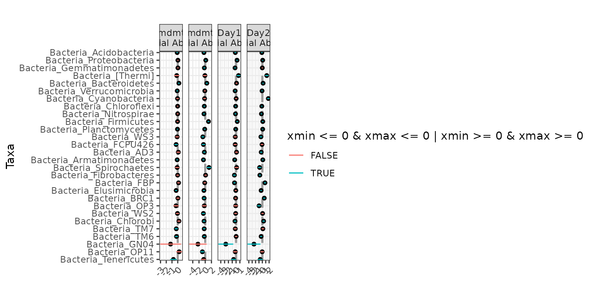
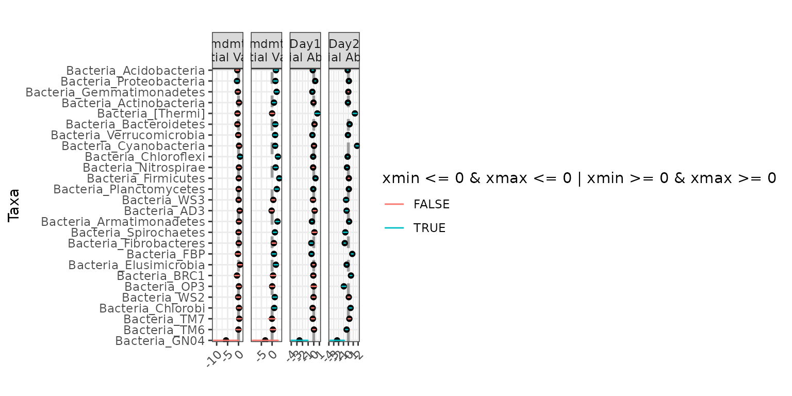
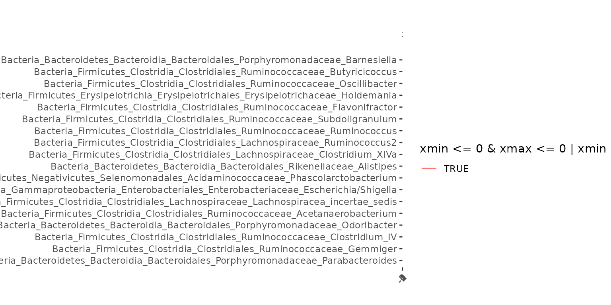

# Introduction to corncob

## Vignette Information

We thank Dr. Thea Whitman for kindly providing us with the example data
set we use for this vignette. You can read more about this data in
Whitman, Thea, et al. “Dynamics of microbial community composition and
soil organic carbon mineralization in soil following addition of
pyrogenic and fresh organic matter.” *The ISME Journal* 10.12 (2016):
2918.

We also use IBD microbiome data from Papa, Eliseo, et al. “Non-Invasive
Mapping of the Gastrointestinal Microbiota Identifies Children with
Inflammatory Bowel Disease.” *PLoS One* 7(6), e39242. The data are made
available by Duvallet, Claire, et al. (2017). “MicrobiomeHD: the human
gut microbiome in health and disease” \[Data set\]. Zenodo. We thank the
authors for making their data open source and easily accessible.

## Introduction

Effectively modeling microbial relative abundance poses a number of
statistical challenges, including:

Here, we introduce `corncob`, an individual taxon regression model that
uses abundance tables and sample data. `corncob` is able to model
differential abundance and differential variability, and addresses each
of the challenges presented above.

Note that in order to follow along with this tutorial (but not to use
`corncob`!) you will need to have `phyloseq` installed. We will check if
you have `phyloseq` installed, and if you do not then you can read the
following code but it will not be run. See the vignette
`corncob-intro-no-phyloseq.Rmd` for a version of this vignette without a
dependence on `phyloseq`.

If your data is in a `TreeSummarizedExperiment` object, or any object
that inherits from `SummarizedExperiment` `corncob` will still work.
`corncob` will assume that the first assay in the assay list of your
`SummarizedExperiment` object is the abundance table of interest, and
that the `colData` slot contains information about the samples.

``` r
phy <- requireNamespace("phyloseq", quietly = TRUE) == TRUE
```

    ## [1] "phyloseq is installed: TRUE"

Install `corncob` using:

``` r
remotes::install_github("statdivlab/corncob")
```

To begin, we load our example data set as three different data frames
and then combine them together into a `phyloseq` object.

``` r
library(corncob)
library(phyloseq)
library(magrittr)
data(soil_phylo_sample)
data(soil_phylo_otu)
data(soil_phylo_taxa)
soil_phylo <- phyloseq::phyloseq(phyloseq::sample_data(soil_phylo_sample),
                                phyloseq::otu_table(soil_phylo_otu, taxa_are_rows = TRUE),
                                phyloseq::tax_table(soil_phylo_taxa))
```

If you are unfamiliar with `phyloseq`, we can view a description of the
data using:

``` r
soil_phylo
```

    ## phyloseq-class experiment-level object
    ## otu_table()   OTU Table:         [ 7770 taxa and 119 samples ]
    ## sample_data() Sample Data:       [ 119 samples by 5 sample variables ]
    ## tax_table()   Taxonomy Table:    [ 7770 taxa by 7 taxonomic ranks ]

We now see that we have an OTU abundance table with 7770 OTUs and 119
samples. We can extract using
[`otu_table()`](https://rdrr.io/pkg/phyloseq/man/otu_table-methods.html).
Let’s examine a small subset of our data in more detail.

``` r
otu_table(soil_phylo)[1:3, 1:3]
```

    ## OTU Table:          [3 taxa and 3 samples]
    ##                      taxa are rows
    ##         S009 S204 S112
    ## OTU.43   350   74  300
    ## OTU.2   1796 4204 1752
    ## OTU.187  280  709  426

We can also see that we have 5 sample variables. We can extract this
using
[`sample_data()`](https://rdrr.io/pkg/phyloseq/man/sample_data-methods.html).
Let’s again examine a small subset in more detail.

``` r
sample_data(soil_phylo)[1:3, ]
```

    ##      Plants DayAmdmt Amdmt ID Day
    ## S009      1       01     1  D   0
    ## S204      1       21     1  D   2
    ## S112      0       11     1  B   1

Our covariates are as follows:

Finally, we have a taxonomy table with 7 taxonomic ranks.

``` r
tax_table(soil_phylo)[1:3, ]
```

    ## Taxonomy Table:     [3 taxa by 7 taxonomic ranks]:
    ##         Kingdom    Phylum           Class                 Order             
    ## OTU.43  "Bacteria" "Nitrospirae"    "Nitrospira"          "Nitrospirales"   
    ## OTU.2   "Bacteria" "Proteobacteria" "Alphaproteobacteria" "Rhizobiales"     
    ## OTU.187 "Bacteria" "Acidobacteria"  "Acidobacteriia"      "Acidobacteriales"
    ##         Family              Genus            Species
    ## OTU.43  "Nitrospiraceae"    "Nitrospira"     ""     
    ## OTU.2   "Bradyrhizobiaceae" "Bradyrhizobium" ""     
    ## OTU.187 "Koribacteraceae"   ""               ""

## Fitting a Model

Now, let’s set up our model.

First, let’s subset our samples to only include those with the
`DayAmdmt` covariate equal to 11 or 21 and then collapse the samples to
the phylum level.

``` r
soil <- soil_phylo %>% 
            phyloseq::subset_samples(DayAmdmt %in% c(11,21)) %>%
            phyloseq::tax_glom("Phylum") 
```

Let’s examine the data and the taxonomy table again.

``` r
soil
```

    ## phyloseq-class experiment-level object
    ## otu_table()   OTU Table:         [ 39 taxa and 32 samples ]
    ## sample_data() Sample Data:       [ 32 samples by 5 sample variables ]
    ## tax_table()   Taxonomy Table:    [ 39 taxa by 7 taxonomic ranks ]

``` r
tax_table(soil)[1:5, ]
```

    ## Taxonomy Table:     [5 taxa by 7 taxonomic ranks]:
    ##         Kingdom    Phylum             Class Order Family Genus Species
    ## OTU.19  "Bacteria" "Acidobacteria"    NA    NA    NA     NA    NA     
    ## OTU.1   "Bacteria" "Proteobacteria"   NA    NA    NA     NA    NA     
    ## OTU.15  "Bacteria" "Gemmatimonadetes" NA    NA    NA     NA    NA     
    ## OTU.3   "Bacteria" "Actinobacteria"   NA    NA    NA     NA    NA     
    ## OTU.133 "Bacteria" "[Thermi]"         NA    NA    NA     NA    NA

Note that collapsing the samples is not necessary, and this model can
work at any taxonomic rank. However, we will later be fitting a model to
every taxa. We can see that by agglomerating taxa to the phylum level,
we have gone from from 7770 to 40 taxa. Thus we collapse in order to
increase the speed for the purposes of this tutorial.

Now we fit our model. We will demonstrate with Proteobacteria, or OTU.1.

For now, we will not include any covariates, so we use `~ 1` as our
model formula responses.

``` r
corncob <- bbdml(formula = OTU.1 ~ 1,
             phi.formula = ~ 1,
             data = soil)
```

## Interpreting a Model

First, let’s plot the data with our model fit on the relative abundance
scale. To do this, we simply type:

``` r
plot(corncob, B = 50)
```


You can access the documentation for this plotting function by typing
[`?plot.bbdml`](https://statdivlab.github.io/corncob/reference/plot.bbdml.md)
into the console.

The points represent the relative abundances. The bars represent the 95%
prediction intervals for the observed relative abundance by sample. The
parameter `B` determines the number of bootstrap simulations used to
approximate the prediction intervals. For purposes of this tutorial, we
use a small value `B = 50` for computational purposes, but recommend a
higher setting for more accurate intervals, such as the default
`B = 1000`.

Now let’s look at the same plot, but on the counts scale with 95%
prediction intervals (since counts is not a parameter). To do this, we
add the option `total = TRUE` to our plotting code.

``` r
plot(corncob, total = TRUE, B = 50)
```


Finally, let’s color the plot by the `DayAmdmt` covariate. To do this,
we add the option `color = "DayAmdmt"` to our plotting code.

``` r
plot(corncob, total = TRUE, color = "DayAmdmt", B = 50)
```


``` r
plot(corncob, color = "DayAmdmt", B = 50)
```


Notice that this plot also reorders our samples so that groups appear
together so that they are easier to compare.

We can observe on this plot that it might be of interest to distinguish
between the two groups with covariates. The average empirical relative
abundance for the samples with `DayAmdmt = 21` tends to be lower and
less variable than the samples with `DayAmdmt = 11`.

If you wish to instead make your own custom plots with these same
coefficients, you can easily extract the data used to generate the plots
above from the `plot` function by setting `data_only = TRUE`:

``` r
df <- plot(corncob, color = "DayAmdmt", B = 50, data_only = TRUE)
head(df)
```

    ##             RA samples      ymin      ymax
    ## S204 0.3619402    S204 0.3141906 0.4346589
    ## S112 0.3751641    S112 0.3134597 0.4295930
    ## S134 0.3416663    S134 0.2808809 0.4330165
    ## S207 0.3283367    S207 0.3168087 0.4314966
    ## S202 0.3543272    S202 0.3020624 0.4102672
    ## S139 0.3712145    S139 0.3203708 0.4624249

## Adding covariates

Let’s try modeling the expected relative abundance and the variability
of the counts with `DayAmdmt` as a covariate. We do this by modifying
`formula` and `phi.formula` as:

``` r
corncob_da <- bbdml(formula = OTU.1 ~ DayAmdmt,
             phi.formula = ~ DayAmdmt,
             data = soil)
```

Let’s also plot this data on both the total count and relative abundance
scales.

``` r
plot(corncob_da, color = "DayAmdmt", total = TRUE, B = 50)
```


``` r
plot(corncob_da, color = "DayAmdmt", B = 50)
```


Visually, the model with covariates seems to provide a much better fit
to the data, but how can we compare the two models statistically?

## Model Selection

Let’s use a likelihood ratio test to select our final model for this
taxon. We want to test the null hypothesis that the likelihood of the
model with covariates is equal to the likelihood of the model without
covariates. To do this test, we use:

``` r
lrtest(mod_null = corncob, mod = corncob_da)
```

    ## [1] 4.550571e-05

We obtain a p-value much smaller than a cut-off of 0.05. Therefore we
conclude that there is a statistically significant difference in the
likelihood of the two models. Thus, we probably want to use the model
with covariates for this taxon.

## Parameter Interpretation

Now that we have chosen our model, let’s interpret our model output. To
see a summary of the model, type:

``` r
summary(corncob_da)
```

    ## 
    ## Call:
    ## bbdml(formula = OTU.1 ~ DayAmdmt, phi.formula = ~DayAmdmt, data = soil)
    ## 
    ## 
    ## Coefficients associated with abundance:
    ##             Estimate Std. Error t value Pr(>|t|)    
    ## (Intercept) -0.44595    0.03604 -12.375 7.18e-13 ***
    ## DayAmdmt21  -0.16791    0.04067  -4.129 0.000297 ***
    ## ---
    ## Signif. codes:  0 '***' 0.001 '**' 0.01 '*' 0.05 '.' 0.1 ' ' 1
    ## 
    ## 
    ## Coefficients associated with dispersion:
    ##             Estimate Std. Error t value Pr(>|t|)    
    ## (Intercept)  -5.3077     0.3537 -15.008 6.44e-15 ***
    ## DayAmdmt21   -1.3518     0.5029  -2.688    0.012 *  
    ## ---
    ## Signif. codes:  0 '***' 0.001 '**' 0.01 '*' 0.05 '.' 0.1 ' ' 1
    ## 
    ## 
    ## Log-likelihood: -286.53

This output will look familiar if you have done regression analysis in R
in the past. Covariates associated with the expected relative abundance
are presented separately from covariates associated with the variance of
the counts are preceded by.

From this model summary, we can see that the `DayAmdmt21` abundance
coefficient is negative and statistically significant. This suggests
that this taxon is differentially-abundant across `DayAmdmt`, and that
samples with `DayAmdmt = 21` are expected to have a lower relative
abundance. This matches what we saw from the observed abundances.

We can also see that the `DayAmdmt21` dispersion coefficient is negative
and statistically significant. This suggests that this taxon is
differentially-variable across `DayAmdmt`, and that samples with
`DayAmdmt = 21` are expected to have a lower variability. This matches
what we saw from the observed abundances.

## Analysis for Multiple Taxa

What if we want to test all the taxa in our data to see if they are
differentially-abundant or differentially-variable? We use the
`differentialTest` function. It will perform the above tests on all
taxa, and it will control the false discovery rate to account for
multiple comparisons.

Next, we use the `differentialTest` command. We specify the covariates
of our model using `formula` and `phi.formula` as before, except we no
longer include the response term because we are testing multiple taxa.
We also specify which covariates we want to test for by removing them in
the `formula_null` and `phi.formula_null` arguments.

The difference between the formulas and the null version of the formulas
are the variables that we test. We will go through several examples,
starting with a test for differential abundance across the `DayAmdmt`
coefficient.

We set `fdr_cutoff` to be our controlled false discovery rate.

``` r
set.seed(1)
da_analysis <- differentialTest(formula = ~ DayAmdmt,
                                 phi.formula = ~ DayAmdmt,
                                 formula_null = ~ 1,
                                 phi.formula_null = ~ DayAmdmt,
                                 test = "Wald", boot = FALSE,
                                 data = soil,
                                 fdr_cutoff = 0.05)
```

We can see the output of the function by calling it:

``` r
da_analysis
```

    ## Object of class differentialTest 
    ## 
    ## $p: p-values 
    ## $p_fdr: FDR-adjusted p-values 
    ## $significant_taxa: taxa names of the statistically significant taxa 
    ## $significant_models: model summaries of the statistically significant taxa 
    ## $all_models: all model summaries 
    ## $restrictions_DA: covariates tested for differential abundance 
    ## $restrictions_DV: covariates tested for differential variability 
    ## $discriminant_taxa_DA: taxa for which at least one covariate associated with the abundance was perfectly discriminant 
    ## $discriminant_taxa_DV: taxa for which at least one covariate associated with the dispersion was perfectly discriminant 
    ## 
    ## plot( ) to see a plot of tested coefficients from significant taxa

We can see a list of differentially-abundant taxa using:

``` r
da_analysis$significant_taxa
```

    ##  [1] "OTU.1"    "OTU.15"   "OTU.8"    "OTU.69"   "OTU.6"    "OTU.59"  
    ##  [7] "OTU.695"  "OTU.628"  "OTU.703"  "OTU.908"  "OTU.1570" "OTU.417" 
    ## [13] "OTU.584"  "OTU.1672"

In this case, we identified several taxa that are
differentially-abundant across `DayAmdmt` (out of the 39 taxa tested).

We can see a list of differentially-variable taxa using:

``` r
set.seed(1)
dv_analysis <- differentialTest(formula = ~ DayAmdmt,
                                 phi.formula = ~ DayAmdmt,
                                 formula_null = ~ DayAmdmt,
                                 phi.formula_null = ~ 1,
                                 data = soil,
                                 test = "LRT", boot = FALSE,
                                 fdr_cutoff = 0.05)
dv_analysis$significant_taxa
```

    ## [1] "OTU.19"  "OTU.69"  "OTU.628" "OTU.703" "OTU.417"

We can switch the OTU labels to taxonomic labels using
`otu_to_taxonomy`. We supply our OTU labels as strings for the `OTU`
argument. We supply the `phyloseq` object for the `data` argument.

``` r
otu_to_taxonomy(OTU = da_analysis$significant_taxa, data = soil)
```

    ##                       OTU.1                      OTU.15 
    ##   "Bacteria_Proteobacteria" "Bacteria_Gemmatimonadetes" 
    ##                       OTU.8                      OTU.69 
    ##    "Bacteria_Bacteroidetes"    "Bacteria_Cyanobacteria" 
    ##                       OTU.6                      OTU.59 
    ##       "Bacteria_Firmicutes"   "Bacteria_Planctomycetes" 
    ##                     OTU.695                     OTU.628 
    ##  "Bacteria_Armatimonadetes"     "Bacteria_Spirochaetes" 
    ##                     OTU.703                     OTU.908 
    ##    "Bacteria_Elusimicrobia"             "Bacteria_BRC1" 
    ##                    OTU.1570                     OTU.417 
    ##              "Bacteria_OP3"              "Bacteria_FBP" 
    ##                     OTU.584                    OTU.1672 
    ##         "Bacteria_Chlorobi"              "Bacteria_TM6"

``` r
otu_to_taxonomy(OTU = dv_analysis$significant_taxa, data = soil)
```

    ##                   OTU.19                   OTU.69                  OTU.628 
    ## "Bacteria_Acidobacteria" "Bacteria_Cyanobacteria"  "Bacteria_Spirochaetes" 
    ##                  OTU.703                  OTU.417 
    ## "Bacteria_Elusimicrobia"           "Bacteria_FBP"

In this case, we identified several taxa that are
differentially-variable across `DayAmdmt` (out of the 40 taxa tested).

We can examine a subset of the p-values of our tests using:

``` r
da_analysis$p[1:5]
```

    ##       OTU.19        OTU.1       OTU.15        OTU.3      OTU.133 
    ## 6.509417e-01 3.642734e-05 3.270448e-13 3.703095e-01 1.031419e-01

We can examine a subset of the p-values after controlling for the false
discovery rate using:

``` r
da_analysis$p_fdr[1:5]
```

    ##       OTU.19        OTU.1       OTU.15        OTU.3      OTU.133 
    ## 7.811301e-01 1.457094e-04 3.924537e-12 5.172748e-01 2.062838e-01

where the values are now adjusted to control the false discovery rate at
0.05.

Now we can use the built-in plotting function in corncob to view the the
model coefficients used in testing differential abundance across
`DayAmdmt` via the
[`plot()`](https://rdrr.io/r/graphics/plot.default.html) function. You
can access the documentation for this plotting function by typing
[`?plot.differentialTest`](https://statdivlab.github.io/corncob/reference/plot.differentialTest.md)
into the console.

``` r
plot(da_analysis)
```


Here, we can see that for `Bacteria_Armatimonadetes`, the effect of
`DayAmdmt21` is positive compared to the baseline (in this case,
`DayAmdmt11`).

If you wish to instead make your own custom plots with these same
coefficients, you can easily extract the data used to generate the plots
above from the `plot` function by setting `data_only = TRUE`:

``` r
df <- plot(da_analysis, data_only = TRUE)

# we can easily remove special characters used in our formatting steps
df <- df %>%
  dplyr::mutate(variable = gsub("\nDifferential Abundance", "",
                                variable, fixed = TRUE))

head(df)
```

    ##            x        xmin        xmax                      taxa   variable
    ## 1 -0.1679129 -0.24761731 -0.08820844   Bacteria_Proteobacteria DayAmdmt21
    ## 2  0.3119623  0.22800588  0.39591870 Bacteria_Gemmatimonadetes DayAmdmt21
    ## 3  0.2306765  0.09148981  0.36986312    Bacteria_Bacteroidetes DayAmdmt21
    ## 4  1.7090454  1.33732670  2.08076404    Bacteria_Cyanobacteria DayAmdmt21
    ## 5 -0.3087530 -0.49665466 -0.12085125       Bacteria_Firmicutes DayAmdmt21
    ## 6  0.2013158  0.11895313  0.28367838   Bacteria_Planctomycetes DayAmdmt21

Finally, we can see a list of any taxa for which we were not able to fit
a model using:

``` r
which(is.na(da_analysis$p)) %>% names
```

    ## [1] "OTU.4206" "OTU.8773" "OTU.8219"

In this case, we weren’t able to fit `OTU.4206` automatically. It’s
worthwhile to investigate the OTU individually if this is the case.
First let’s check what phylum this represents.

``` r
otu_to_taxonomy(OTU = "OTU.4206", data = soil)
```

    ##        OTU.4206 
    ## "Bacteria_GN04"

It may be that the model is overparameterized because there aren’t
enough observations, or it may just be that the initializations were
invalid for that taxa and it needs to be re-evaluated with new
initializations.

Let’s first try examining the data.

``` r
otu_table(soil)["OTU.4206"]
```

    ## OTU Table:          [1 taxa and 32 samples]
    ##                      taxa are rows
    ##          S204 S112 S134 S207 S202 S139 S122 S212 S117 S104 S214 S109 S217 S229
    ## OTU.4206    0    0    0    0    0    0    0    0    0    0    0    0    0    0
    ##          S132 S209 S227 S107 S237 S224 S127 S137 S114 S124 S119 S219 S232 S129
    ## OTU.4206    0    0    0    0    0    0    0    0    0    0    0    0    0    0
    ##          S102 S234 S222 S239
    ## OTU.4206    1    0    0    0

We see that the observed counts of OTU is zero in all samples except for
`S102`, where we observed a single count. Let’s try fitting the model
individually by letting the model select the initializations
automatically.

``` r
check_GN04 <- bbdml(formula = OTU.4206 ~ DayAmdmt,
                 phi.formula = ~ DayAmdmt,
                 data = soil)
```

    ## Warning: Separation detected in abundance model!
    ## Likely, one of your covariates/experimental conditions is such that
    ## there are all zero counts within a group. The results of this model should
    ## be interpreted with care because there is insufficient data to distinguish between groups.

    ## Warning: Separation detected in dispersion model!
    ## Likely, one of your covariates/experimental conditions is such that
    ## there are all zero counts within a group. The results of this model should
    ## be interpreted with care because there is insufficient data to distinguish between groups.

While the model fits, we should be skeptical of **any** statistical
model fit on a single observed count!

`corncob` is stable, but if you notice any issues, please [log them on
Github](https://github.com/statdivlab/corncob/issues) to help us help
you!

## Examples of Answering Scientific Questions

We will now walk through several scientific questions of interest and
show how they can be answered using hypothesis testing with `corncob`.
Note that `Day` and `Amdmt` are both factor covariates with levels 0, 1,
and 2.

Note that some of these are rather strange tests, and shown for
demonstration of the flexibility of the model only. Normally, when
testing for differential variability across a covariate, we recommend
always controlling for the effect of that covariate on the abundance. We
first demonstrate examples with the soil dataset.

``` r
soil_full <- soil_phylo %>% 
  tax_glom("Phylum") 
```

Testing for differential abundance across `Day`, without controlling for
anything else:

``` r
ex1 <- differentialTest(formula = ~ Day,
                                 phi.formula = ~ 1,
                                 formula_null = ~ 1,
                                 phi.formula_null = ~ 1,
                                 data = soil_full,
                                 test = "Wald", boot = FALSE,
                                 fdr_cutoff = 0.05)
plot(ex1)
```



Testing for differential abundance across `Day`, controlling for the
effect of `Day` on dispersion:

``` r
ex2 <- differentialTest(formula = ~ Day,
                                 phi.formula = ~ Day,
                                 formula_null = ~ 1,
                                 phi.formula_null = ~ Day,
                                 data = soil_full,
                                 test = "Wald", boot = FALSE,
                                 fdr_cutoff = 0.05)
plot(ex2)
```



Jointly testing for differential abundance and differential variability
across `Day`:

``` r
ex3 <- differentialTest(formula = ~ Day,
                                 phi.formula = ~ Day,
                                 formula_null = ~ 1,
                                 phi.formula_null = ~ 1,
                                 data = soil_full,
                                 test = "Wald", boot = FALSE,
                                 fdr_cutoff = 0.05)
plot(ex3)
```



Jointly testing for differential abundance and differential variability
across `Day`, controlling for the effect of `Amdmt` on abundance only:

``` r
ex4 <- differentialTest(formula = ~ Day + Amdmt,
                                 phi.formula = ~ Day,
                                 formula_null = ~ Amdmt,
                                 phi.formula_null = ~ 1,
                                 data = soil_full,
                                 test = "Wald", boot = FALSE,
                                 fdr_cutoff = 0.05)
plot(ex4)
```



Jointly testing for differential abundance across `Day` and differential
abundance across `Amdmt`, controlling for the effect of `Day` and
`Amdmt` on dispersion:

``` r
ex5 <- differentialTest(formula = ~ Day + Amdmt,
                                 phi.formula = ~ Day + Amdmt,
                                 formula_null = ~ 1,
                                 phi.formula_null = ~ Day + Amdmt,
                                 data = soil_full,
                                 test = "Wald", boot = FALSE,
                                 fdr_cutoff = 0.05)
plot(ex5)
```



Jointly testing for differential abundance across `Day`, and
differential dispersion across `Amdmt`, controlling for the effect of
`Day` on Dispersion:

``` r
ex6 <- differentialTest(formula = ~ Day,
                                 phi.formula = ~ Day + Amdmt,
                                 formula_null = ~ 1,
                                 phi.formula_null = ~ Day,
                                 data = soil_full,
                                 test = "Wald", boot = FALSE,
                                 fdr_cutoff = 0.05)
plot(ex6)
```



We now demonstrate examples with the IBD data set. We again begin by
agglomerating for purposes of demonstration. We agglomerate to the genus
level.

``` r
data(ibd_phylo_sample)
data(ibd_phylo_otu)
data(ibd_phylo_taxa)
ibd_phylo <-  phyloseq::phyloseq(phyloseq::sample_data(ibd_phylo_sample), 
                                 phyloseq::otu_table(ibd_phylo_otu, taxa_are_rows = TRUE),
                                 phyloseq::tax_table(ibd_phylo_taxa))
ibd <- ibd_phylo %>% 
            phyloseq::tax_glom("Genus") 
```

Testing for differential abundance across IBD status, without
controlling for anything else:

``` r
ex7 <- differentialTest(formula = ~ ibd,
                                 phi.formula = ~ 1,
                                 formula_null = ~ 1,
                                 phi.formula_null = ~ 1,
                                 data = ibd,
                                 test = "Wald", boot = FALSE,
                                 fdr_cutoff = 0.05)
plot(ex7)
```



We can make the plot cleaner using the `level` parameter. Here we will
display both the family and genus information.

``` r
plot(ex7, level = c("Family", "Genus"))
```


Jointly testing for differential abundance and differential variability
across IBD status, without controlling for anything else:

``` r
ex8 <- differentialTest(formula = ~ ibd,
                                 phi.formula = ~ ibd,
                                 formula_null = ~ 1,
                                 phi.formula_null = ~ 1,
                                 data = ibd,
                                 test = "Wald", boot = FALSE,
                                 fdr_cutoff = 0.05)
plot(ex8, level = "Genus")
```


